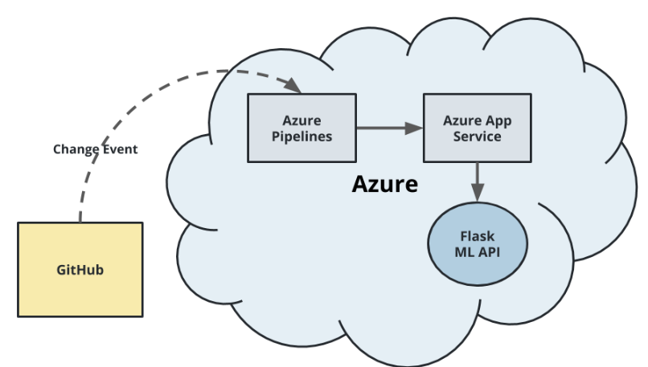
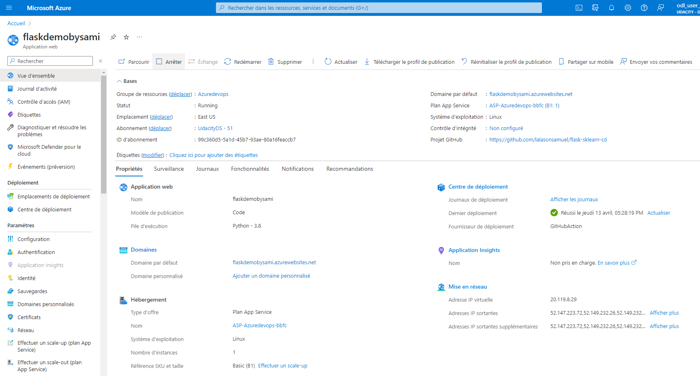
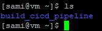
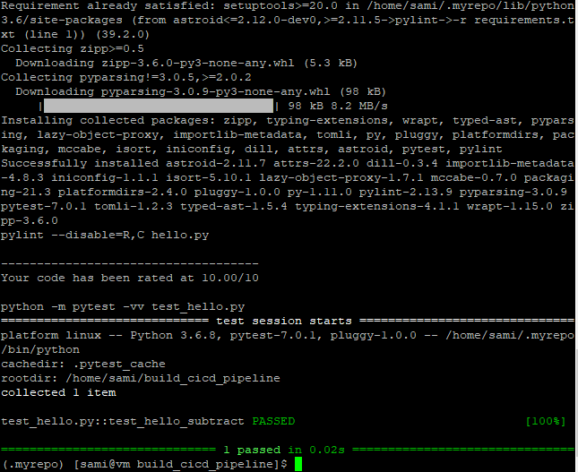
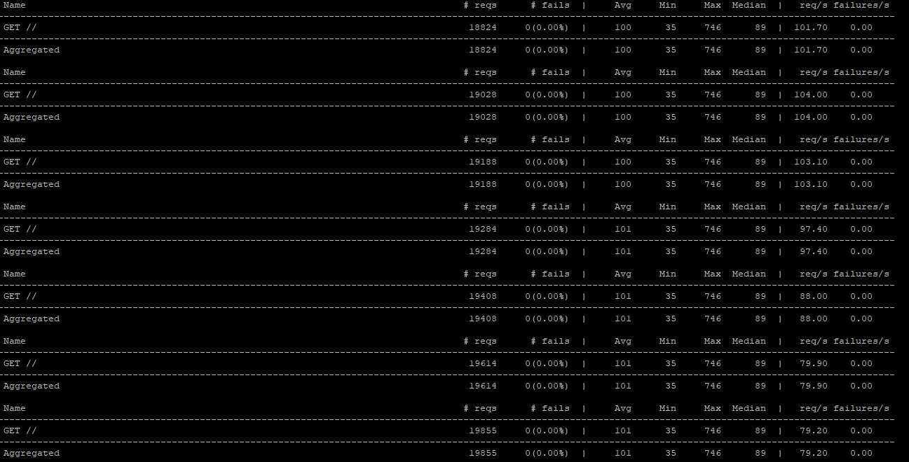
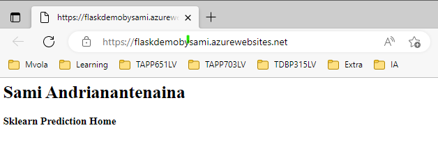
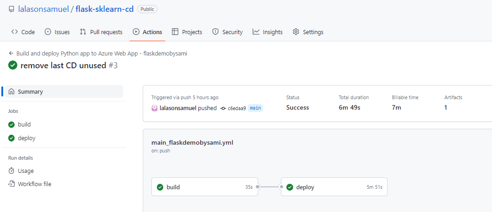
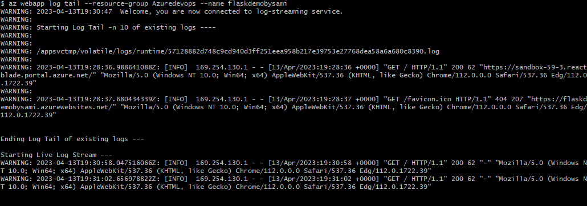

# Overview

<TODO: complete this with an overview of your project>
In this project, you will involve setting up Azure Pipelines to deploy the Flask starter code to azure App service.

## Getting Started
Before you deploy the infrastructure, you will need to:
* Clone the repository
* Creating a Azure App service
* Deploying the App with Azure Pipelines

## Project Plan
<TODO: Project Plan

* A link to a Trello board for the project
* A link to a spreadsheet that includes the original and final project plan>

[A link to a Trello board for the project](https://trello.com/invite/b/wbrvZFhJ/ATTI80aceba5e4e85513d2f1211ecbde8fe33B171EC7/azure-app-service)

## Instructions

* Architectural Diagram (Shows how key parts of the system work)


<TODO:  Instructions for running the Python project.  How could a user with no context run this project without asking you for any help.  Include screenshots with explicit steps to create that work. Be sure to at least include the following screenshots:>
* Create Azure App Service

* Project running on Azure App Service


* Project cloned into Azure Cloud Shell <br>
 

* Passing tests that are displayed after running the `make all` command from the `Makefile`


* Output of a test run with locust


* Successful deploy of the project in Azure Pipelines.



* Running Azure App Service from Azure Pipelines automatic deployment


* Successful prediction from deployed flask app in Azure Cloud Shell.
```bash
udacity@Azure:~$ ./make_predict_azure_app.sh
Port: 443
{"prediction":[20.35373177134412]}
```

* Output of streamed log files from deployed application


## Enhancements

<TODO: A short description of how to improve the project in the future>

## Demo 

<TODO: Add link Screencast on YouTube>


