[](https://github.com/lalasonsamuel/flask-sklearn-cd/actions/workflows/pylint.yml)

# Overview

<TODO: complete this with an overview of your project>
In this project, you will involve setting up Azure Pipelines to deploy the Flask starter code to azure App service.

# Getting Started
Before you deploy the infrastructure, you will need to:
* Clone the repository
* Creating a Azure App service
* Deploying the App with Azure Pipelines

# Project Plan
<TODO: Project Plan

* A link to a Trello board for the project
* A link to a spreadsheet that includes the original and final project plan>

[A link to a Trello board for the project](https://trello.com/invite/b/wbrvZFhJ/ATTI80aceba5e4e85513d2f1211ecbde8fe33B171EC7/azure-app-service)

# Instructions

## Create a Web App Manually
Before we set up a pipeline, let's learn how to create an Azure Web App manually. You can try the following steps either in a Cloud shell, Linux/Mac terminal, or Windows Git bash terminal.
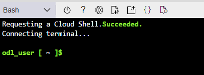

1. Clone the repo in Cloud shell
In your Azure Cloud shell environment, clone the GitHub repository you created.
```bash
# Run these in the Cloud shell
git clone https://github.com/lalasonsamuel/flask-sklearn-cd.git
cd flask-sklearn-cd/
```

- [Optional Step] [Only if you want to test the app locally first]
Create a virtual environment, install the dependencies, and run the app
```bash
python3 -m venv ~/.myvenv
source ~/.myvenv/bin/activate
make install
python -m flask run
```

- Create a web app service
Create an app service and initially deploy your app in Cloud Shell:
```bash
# TODO: Provide the web app name as a globally unique value, e.g., mywebapp20223110 and the name of the existing resource group
az webapp up --name flasksklearnbysami --resource-group Azuredevops --runtime "PYTHON:3.7"
```

This is the result:
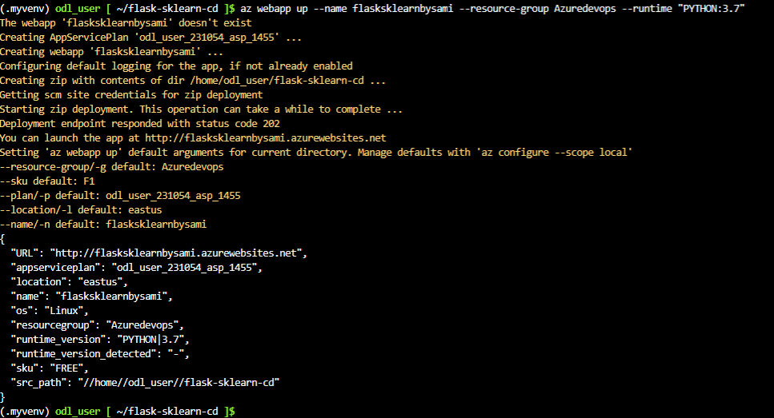
- Verify
Verify the deployed application works by browsing to the deployed URL. Go to https://flasksklearnbysami.azurewebsites.net/ and you should see the output as in the screenshot below:
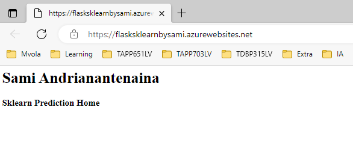

- [Optional Step] Perform Prediction
Edit the make_predict_azure_app.sh file to match the deployed URL:
```bash
# TODO: Replace the <yourappname> with your application name 
-X POST https://<yourappname>.azurewebsites.net:$PORT/predict
```

- to get logs
```bash
az webapp log tail --resource-group Azuredevops --name flasksklearnbysami
```
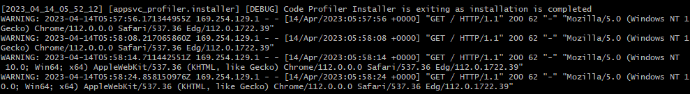

- to delete the web app
```bash
az webapp delete -n flasksklearnbysami -g Azuredevops
```

## Configuration Azure Pipeline
https://learn.udacity.com/nanodegrees/nd082/parts/cd1806/lessons/9ea3d84d-302a-4458-aaf2-052bfa9fbd53/concepts/2e930aa6-9af8-46ec-bcbe-077751fe0e8b


### Create an Agent 
Add agent pool
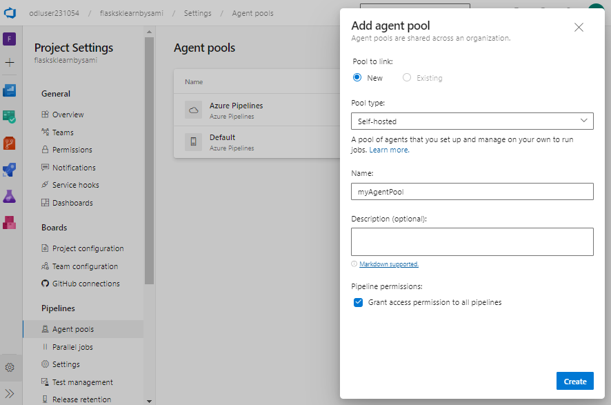

### Create a Personal Access Token (PAT)
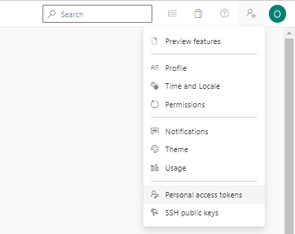
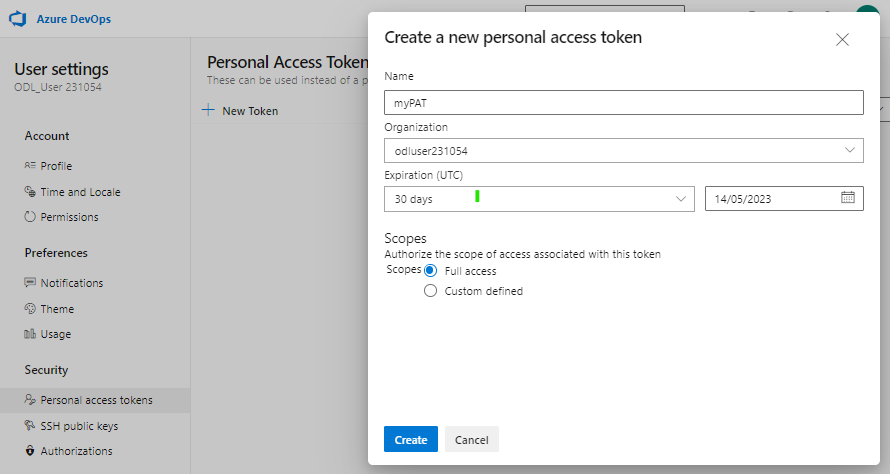
Token: cd5eqznk2lt4tx4dre6wa4tcnfffywkcl4t7cxhwlyqnktbzvajq


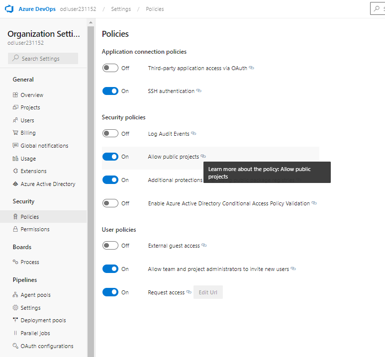


### Create a Linux VM for agentPool
https://learn.udacity.com/nanodegrees/nd082/parts/cd1806/lessons/9ea3d84d-302a-4458-aaf2-052bfa9fbd53/concepts/2e930aa6-9af8-46ec-bcbe-077751fe0e8b
Navigate to the "Virtual machines" service in the Azure Portal, and then select "+ Create" to create a VM.
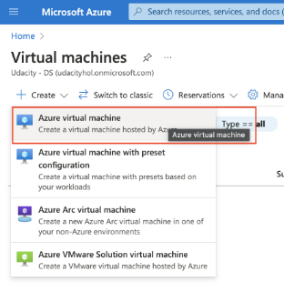

Configure the Linux VM as an Azure DevOps Build Agent
Copy the Public IP address from the overview section of the virtual machine, say 70.37.97.22.
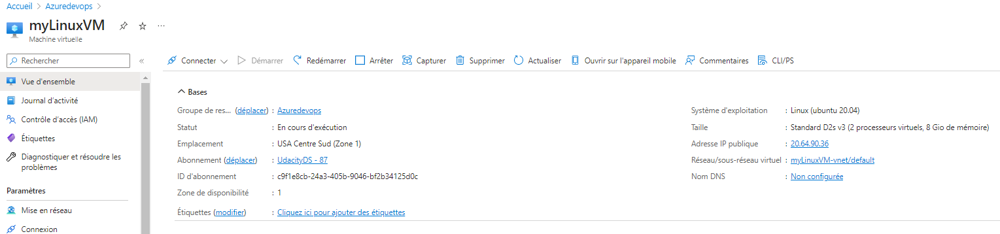

Run the following commands from an Azure cloud shell or terminal or command prompt.
``` bash
# Replace the IP address as applicable to you
ssh devopsagent@70.37.97.22
```

After you SSH into the VM, install Docker as:
sudo snap install docker
``` bash
# Check Python version because this agent will build your code
python3 --version
```


Configure the devopsagent user to run Docker as:
``` bash
sudo groupadd docker
sudo usermod -aG docker $USER
exit
```

- Restart the Linux VM from Azure portal to apply changes made in previous steps. Restarting the VM will log you out from the SSH log in. You will have to log back in using the same SSH command. Do note the new public IP, if it has been changed after the VM restart.

- Go back to the DevOps portal, and open the newly created Agent pool to add a new agent. The snapshot below will help you understand better.
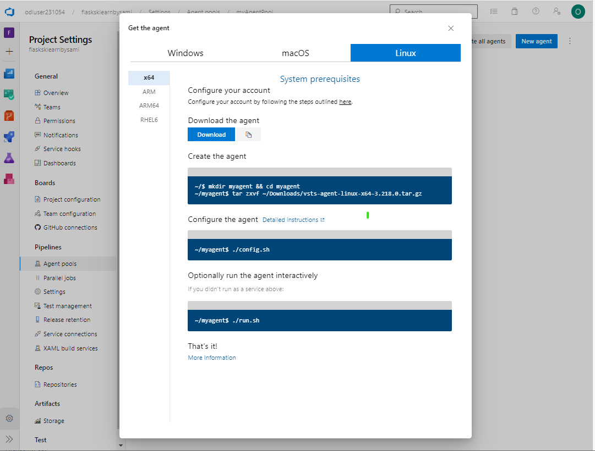

Copy the commands to download, create and configure the Linux x64 agent. The commands will be similar to the following:
``` bash
# Copy and use the link from the Download button
curl -O https://vstsagentpackage.azureedge.net/agent/3.218.0/vsts-agent-linux-x64-3.218.0.tar.gz
# Create the agent
mkdir myagent && cd myagent
tar zxvf ../vsts-agent-linux-x64-3.218.0.tar.gz
# Configure the agent
./config.sh
```
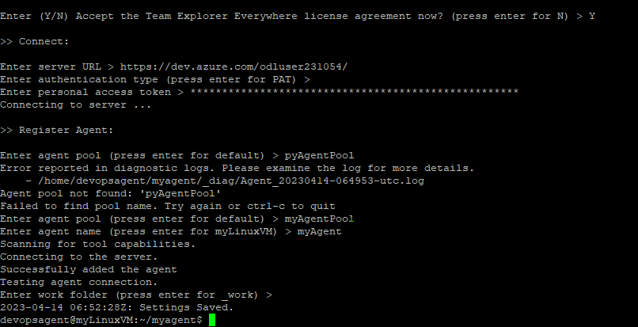

Run the following commands to finish the set up.
``` bash
sudo ./svc.sh install
sudo ./svc.sh start
```
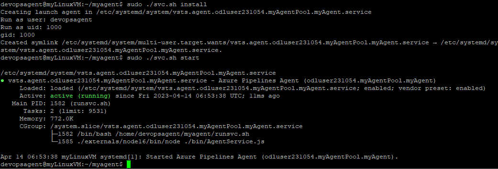


### Install Application-specific depedencies
Prepare the agent for building the Flask application
We have to install some additional packages to enable our agent build the Flask application code. These commands are specific to our sample Flask application, you can extend them per your application requirements:
``` bash
sudo apt-get update
sudo apt update
sudo apt install software-properties-common
sudo add-apt-repository ppa:deadsnakes/ppa
# Check if the VM has Python installed already. 
# Otherwise, use these commands to install Python
sudo apt install python3.7
sudo apt-get install python3.7-venv
sudo apt-get install python3-pip
python3.7 --version
pip --version 
# Important tools for the Pipeline build steps
sudo apt-get install python3.7-distutils
sudo apt-get -y install zip
```
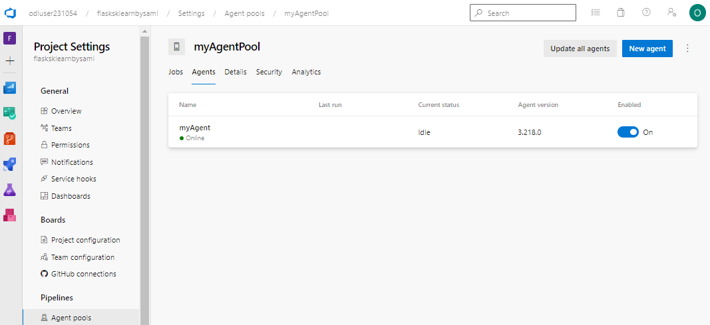


## Create Pipeline project on public
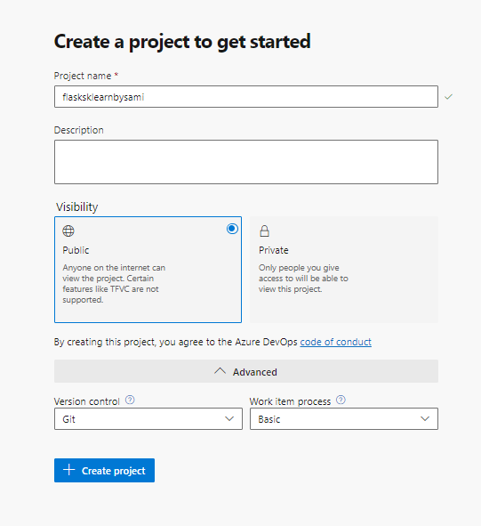
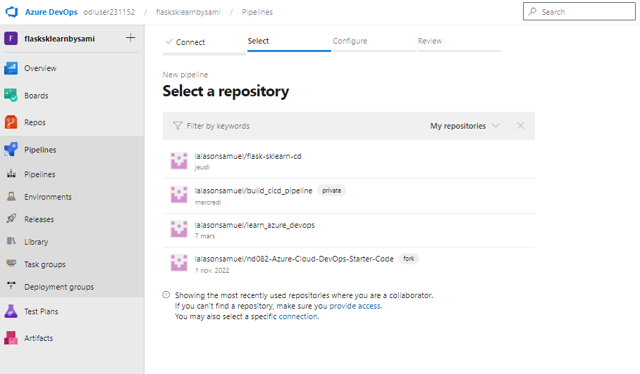


Set project-level pipeline permissions
Do the following steps to set project-level permissions for all pipelines.

Sign in to your organization (https://dev.azure.com/{yourorganization}).

From within your project, select Pipelines > Pipelines.

The Deploy Web App stage in our example will need your permission to deploy the build artifact to the Azure Web App. You can update the pipline permissions for the current user in the Pipelines >> More actions as outlined here and shown in the snapshots below.

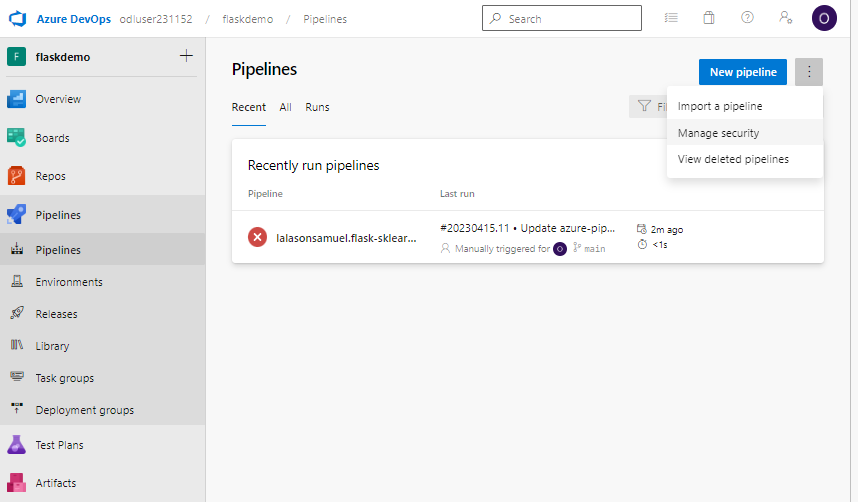
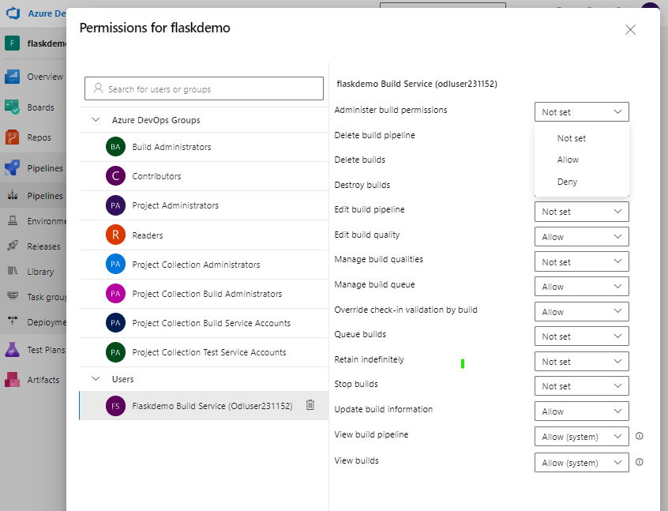

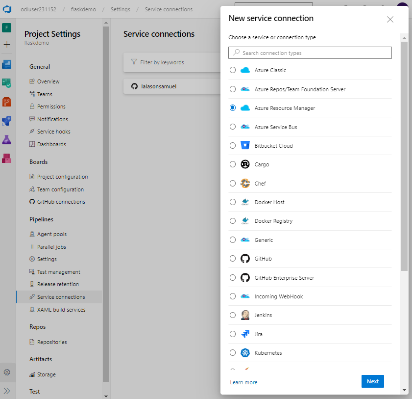
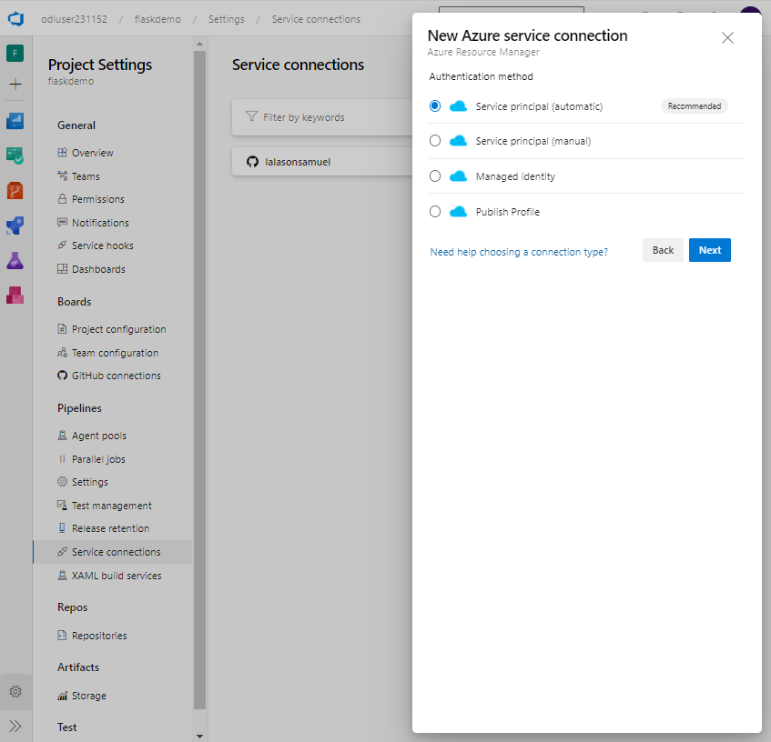
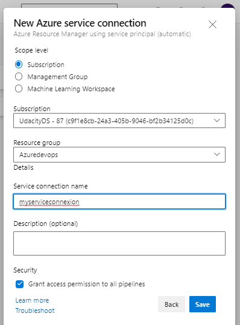


-- script yml to deploy

``` yml
# Starter pipeline    
# Start with a minimal pipeline that you can customize to build and deploy your code.
# Add steps that build, run tests, deploy, and more:
# https://aka.ms/yaml
trigger:
- master

pool: myAgentPool

variables:
  # Azure Resource Manager connection created during pipeline creation
  azureServiceConnectionId: 'c9f1e8cb-24a3-405b-9046-bf2b34125d0c'
  
  
  # Web app name
  webAppName: 'flasksklearnbysami'

  # Environment name
  environmentName: 'flask-ml-service'

  # Project root folder. Point to the folder containing manage.py file.
  projectRoot: $(System.DefaultWorkingDirectory)

stages:
- stage: Build
  displayName: Build stage
  jobs:
  - job: BuildJob
    pool: myAgentPool
    steps:
    - script: echo Hello, world!
      displayName: 'Run a one-line script'

    - script: |
        echo Add other tasks to build, test, and deploy your project.
        echo See https://aka.ms/yaml
      displayName: 'Run a multi-line script'
    
    - script: |
        export PATH=$HOME/.local/bin:$PATH
        make install
      workingDirectory: $(projectRoot)
      displayName: 'myStep 1 - Install dependance'
    
    - task: ArchiveFiles@2
      displayName: 'myStep 4 - Archive files'
      inputs:
        rootFolderOrFile: '$(Build.SourcesDirectory)'
        includeRootFolder: false
        archiveType: zip
        archiveFile: $(Build.ArtifactStagingDirectory)/$(Build.BuildId).zip
        replaceExistingArchive: true

    - upload: $(Build.ArtifactStagingDirectory)/$(Build.BuildId).zip
      displayName: 'myStep 5 - Upload package'
      artifact: drop

- stage: Deploy
  displayName: Deploy stage
  dependsOn: Build
  jobs:
  - deployment: DeployJob
    pool: myAgentPool
    environment: '$(environmentName)'
    strategy:
      runOnce:
        deploy:
          steps:
          - task: DownloadPipelineArtifact@2
            inputs:
              source: 'current'
              artifact: 'drop'
              path: '$(Pipeline.Workspace)'

          - task: AzureWebApp@1
            inputs:
              azureSubscription: myserviceconnexion
              appType: webAppLinux
              appName: $(webAppName)
              package: '$(Pipeline.Workspace)/drop/$(Build.BuildId).zip'
```
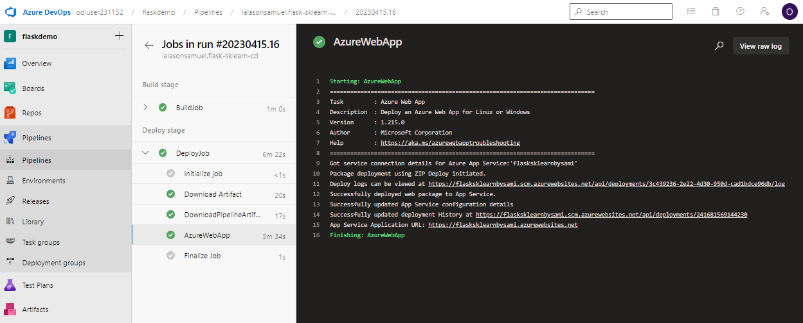
